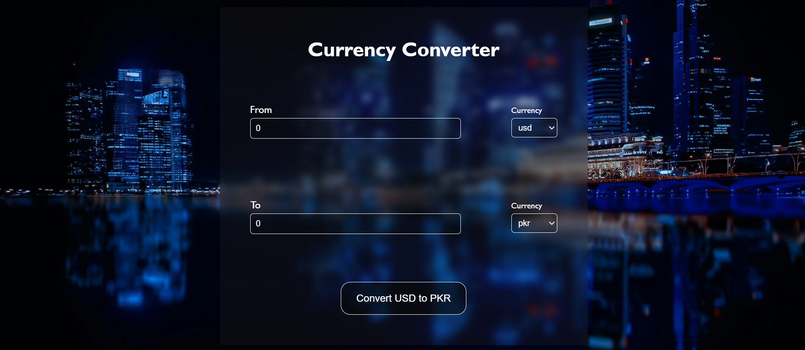

[Overview](#overview)

 [Live Demo](#live-demo)

 [API](#api)

 [Features](#features)

 [Tech Stack](#tech-stack)

 [What I learned](#what-i-learned)

#  Overview

A simple and responsive Currency Converter built using React, Vite, and CSS.  
This app allows users to convert between multiple currencies in real-time using the latest exchange rates fetched from a public API.

##  Live Demo

 [View Live Project](https://your-username.github.io/your-repo-name/)

## API
https://cdn.jsdelivr.net/npm/@fawazahmed0/currency-api@latest/v1/currencies.json

##  Features

-  Real-time currency conversion  
-  Supports multiple currencies  
-  Automatic exchange rate updates  
-  Clean and responsive user interface  
-  Built with Vite for fast development and build times  

##  Tech Stack

- React – Frontend library  
- Vite – Lightning-fast build tool  
- CSS – For styling and layout  
- Exchange Rate API – For live currency data  

##  Preview

##  What I Learned

- How to build a project using React with Vite 
- How to integrate APIs for live data fetching  
- How to manage state using useState and useEffect hooks  
- Styling responsive layouts with CSS  
